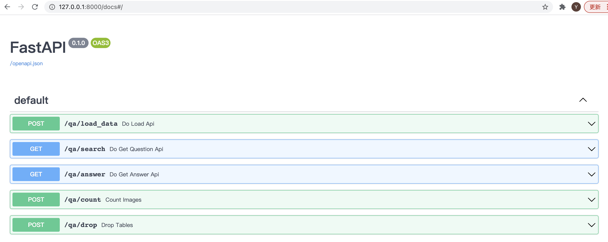

# Quick Start


This project combines Milvus and BERT to build a question and answer system. This aims to provide a solution to achieve semantic similarity matching with Milvus combined with AI models.

> This project is based on Milvus2.0.0-rc5

## Data description

The dataset needed for this system is a CSV format file which needs to contain a column of questions and a column of answers.

There is a sample data in the data directory.

## How to deploy the system

### 1. Start Milvus and MySQL

The system will use Milvus to store and search the feature vector data, and Mysql is used to store the correspondence between the ids returned by Milvus and the questions data set, then you need to start Milvus and Mysql first.

- **Start Milvus v2.0**

  First, you are supposed to refer to the Install [Milvus v2.0](https://milvus.io/docs/v2.0.0/install_standalone-docker.md) for how to run Milvus docker.

  > Note:
  >
  > Please pay attention to the version of Milvus when installing

- **Start MySQL**

```bash
$ docker run -p 3306:3306 -e MYSQL_ROOT_PASSWORD=123456 -d mysql:5.7
```

### 2. Start Server

The next step is to start the system server. It provides HTTP backend services, and there are two ways to start: running with Docker or source code.

#### 2.1 Run server with Docker

- **Set parameters**

  Please modify the parameters according to your own environment. Here listing some parameters that need to be set, for more information please refer to [config.py](server/src/config.py).

  | **Parameter**   | **Description**                                       | **example**  |
  | --------------- | ----------------------------------------------------- | ------------ |
  | **MILVUS_HOST** | The IP address of Milvus, you can get it by ifconfig. | 127.0.0.1    |
  | **MILVUS_PORT** | The port of Milvus.                                   | 19530        |
  | **MYSQL_HOST**  | The IP address of MySQL.                              | 127.0.0.1    |
  | **MYSQL_PORT**  | The port of MySQL                                     | 3306         |

  ```
  $ export Milvus_HOST='127.0.0.1'
  $ export Milvus_PORT='19530'
  $ export Mysql_HOST='127.0.0.1'
  ```

- **Run Docker**

  > This image qa-chatbot-server:v1 is based Milvus2.0-rc3, if you want to use docker to start the Q&A server with Milvus2.0-rc5, please use the Dockerfile to build a new qa-chatbot image.
  
  ```
  $ docker run -d \
  -p 8000:8000 \
  -e "MILVUS_HOST=${Milvus_HOST}" \
  -e "MILVUS_PORT=${Milvus_PORT}" \
  -e "MYSQL_HOST=${Mysql_HOST}" \
  milvusbootcamp/qa-chatbot-server:v1
  ```

#### 2.2 Run source code

- **Install the Python packages**

  ```shell
  $ cd server
  $ pip install -r requirements.txt
  ```

- **wget the model**

  ```bash
  $ mkdir -p server/src/models
  $ cd server/src/models
  $ wget https://public.ukp.informatik.tu-darmstadt.de/reimers/sentence-transformers/v0.2/paraphrase-mpnet-base-v2.zip
  $ unzip paraphrase-mpnet-base-v2.zip -d paraphrase-mpnet-base-v2/
  ```

- **Set configuration**

  ```bash
  $ vim server/src/config.py
  ```

  Please modify the parameters according to your own environment. Here listing some parameters that need to be set, for more information please refer to [config.py](./server/src/config.py).

  | **Parameter**    | **Description**                                       | **Default setting** |
  | ---------------- | ----------------------------------------------------- | ------------------- |
  | MILVUS_HOST      | The IP address of Milvus, you can get it by ifconfig. | 127.0.0.1           |
  | MILVUS_PORT      | Port of Milvus.                                       | 19530               |
  | VECTOR_DIMENSION | Dimension of the vectors.                             | 768                 |
  | MYSQL_HOST       | The IP address of Mysql.                              | 127.0.0.1           |
  | MYSQL_PORT       | Port of Milvus.                                       | 3306                |
  | DEFAULT_TABLE    | The milvus and mysql default collection name.         | milvus_qa_search_1  |
  | MODEL_PATH       | The path of the model `paraphrase-mpnet-base-v2`      |                     |

- **Run the code**

  Then start the server with Fastapi.

```bash
$ cd server/src
$ python main.py
```

#### 2.3 API docs

After starting the service, Please visit `127.0.0.1:8000/docs` in your browser to view all the APIs.




> **/qa/load_data**
>
> This API is used to import Q&A datasets into the system.
>
> **/qa/search**
>
> This API is used to get similar questions in the system.
>
> **/qa/answer**
>
> This API is used to get the answer to a given question in the system.
>
> **/qa/count**
>
> This API is used to get the number of the questions in the system.
>
> **/qa/drop**
>
> This API is used to delete a specified collection.


### 3. Start Client

- **Start the front-end**

  ```bash
  # Please modify API_URL to the IP address and port of the server.
  $ export API_URL='http://127.0.0.1:8000'
  $ docker run -d -p 80:80 \
  -e API_URL=${API_URL} \
  milvusbootcamp/qa-chatbot-client:v1
  ```

- **How to use**

  Enter `WEBCLIENT_IP:80` in the browser to open the interface for reverse image search.

  > `WEBCLIENT_IP` specifies the IP address that runs qa-chatbot-client docker.

  i. **Load data**: Click the `upload` button, and then select a csv Q&A data file from the local to import it into the Q&A chatbot system. For the data format, you can refer to example_data in the data directory of this project.


  ii. **Retrieve similar questions**:  Enter a question in the dialog, and then you'll get five questions most similar to the question in the Q&A library.


  iii. **Obtain answer**: Click any of the similar questions obtained in the previous step, and you'll get the answer.
